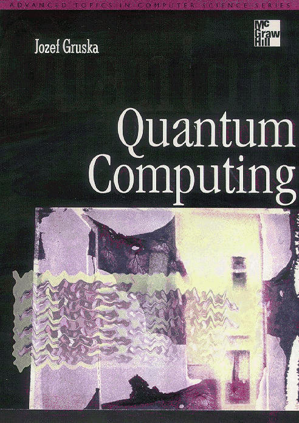

# "Keep learning, or risk becoming irrelevant."

## Publicly available quantum computing books (WIP)

<h1 align="center">    
  </a>  
</h1>

## Introduction
 
Building a quantum computer requires **multidisciplinary knowledge** involving experimental and theoretical physics, photonics, computer science, software engineering, and of course quantum mechanics. 

**If you are a computer scientist or a physicist aspiring to become a quantum computing scientist, this list is for you.** 

The topics include:

- **Quantum mechanics**
- **Quantum information processing**
- **Quantum computing**
- **Quantum information theory**

**If you are also considering graduate school**, you should start by reading: *"Preparing for the quantum revolution: What is the role of higher education"*

[https://par.nsf.gov/servlets/purl/10233228](https://par.nsf.gov/servlets/purl/10233228)

# Math and physics refresher course:

http://salfordphysics.com/gsmcdonald/pp/PPLATOResources/PPLATO.htm

http://salfordphysics.com/gsmcdonald/hFLAPP.php

# The largest QM resource listing: (Frank Rioux Professor Emeritus Department of Chemistry)

https://faculty.csbsju.edu/frioux/workinprogress.html

# Online PDF books:

http://www.thomaswong.net/introduction-to-classical-and-quantum-computing.pdf

https://www.doc.ic.ac.uk/~ae/papers/qc.pdf

https://cse.sc.edu/~fenner/csce790/notes/course-notes.pdf

https://web.eecs.utk.edu/~ggu1/files/ECE692SemicondFundm_03_QuantumMechanicsPrimer.pdf

https://lapastillaroja.net/wp-content/uploads/2016/09/Intro_to_QC_Vol_1_Loceff.pdf

https://baraksh.com/4P51/Barak_Shoshany_PHYS_4P51_Lecture_Notes.pdf

https://research.iqc.uwaterloo.ca/csg/wp-content/uploads/2009/11/Intro-QIP-and-QC.pdf

http://www.umsl.edu/~majzoube/docs/QM_primer_v3.x.pdf

https://commons.library.stonybrook.edu/cgi/viewcontent.cgi?article=1005&context=egp

https://everettyou.github.io/teaching/PHYS212A/QubitsAndEntanglement.pdf

https://www.itp.tu-berlin.de/fileadmin/a3233/upload/SS16/PQC/PQC_LectureNotes.pdf

http://www.umsl.edu/~majzoube/docs/QM_primer_v3.x.pdf

http://cleve.iqc.uwaterloo.ca/resources/QIC-710-F21/Qic710QuantumAlgorithmsPart1.pdf

http://physics.mq.edu.au/~jcresser/Phys301/Chapters/ToC.pdf

https://people.eecs.berkeley.edu/~vazirani/f19quantum/notes/vidick.pdf

https://edu.itp.phys.ethz.ch/hs15/QIT/renes_lecture_notes14.pdf

https://arxiv.org/pdf/1905.00282.pdf

https://www.fi.muni.cz/usr/gruska/qbook1.pdf

https://www.physics.princeton.edu/~mcdonald/examples/ph410problems.pdf

https://www.chem.uci.edu/~unicorn/249/Handouts/QMPostulates2020.pdf

https://uwaterloo.ca/institute-for-quantum-computing/sites/ca.institute-for-quantum-computing/files/uploads/files/mathematics_qm_v22.pdf

https://faculty.csbsju.edu/frioux/matmech/RudimentaryMatrixMechanics.pdf

https://www.chalmers.se/en/centres/wacqt/graduate%20school/aqa/Documents/FullLectureNotes.pdf

https://wdscultan.github.io/files/qphys.pdf

https://girvin.sites.yale.edu/sites/default/files/_girvin_introduction_to_quantum_2020.05.02_v1_0.pdf

https://core.ac.uk/download/pdf/25245217.pdf

https://www-m5.ma.tum.de/foswiki/pub/M5/Allgemeines/MA5057_2019S/QIPlecture.pdf

https://www.carlosnb.com/quantum-optics-course

https://www.fi.muni.cz/usr/gruska/quantum20/

https://www.itp.uni-hannover.de/fileadmin/itp/emeritus/dragon/qm_eng.pdf

https://wdscultan.github.io/files/qphys.pdf

https://scholar.harvard.edu/files/noahmiller/files/statistical_mechanics.pdf

# Online tutorials:

http://www.vcpc.univie.ac.at/~ian/hotlist/qc/intro.shtml

https://phsites.technion.ac.il/quantum-computing-technion-school/exercises-lecture-notes-and-slides/

http://davidbkemp.github.io/QuantumComputingArticle/

https://heyredhat.github.io/

https://qosf.org/learn_quantum/

https://aroosaijaz.github.io/talks/

https://phsites.technion.ac.il/quantum-computing-technion-school/recorded-lectures/

https://www.cl.cam.ac.uk/teaching/1718/QuantComp/

https://www.cl.cam.ac.uk/teaching/1617/QuantComp/materials.html

https://www.qi.damtp.cam.ac.uk/part-ib-quantum-mechanics

http://theory.caltech.edu/~preskill/ph219/ph219_2021-22.html

https://www.youtube.com/playlist?list=PL0ojjrEqIyPy-1RRD8cTD_lF1hflo89Iu

https://www.youtube.com/playlist?list=PLQOPozM-bhZrWIyxwD_sMe9Q0HvwMzJNS

http://davidbkemp.github.io/QuantumComputingArticle/

https://www-inst.eecs.berkeley.edu/~cs191/sp05/

http://www-thphys.physics.ox.ac.uk/people/FabianEssler/Quantum.html

https://www.uio.no/studier/emner/matnat/math/MAT3420/v21/timeplan/index.html#FOR

https://bingweb.binghamton.edu/~suzuki/QuantumMechanics.html

http://cleve.iqc.uwaterloo.ca/qic710/

https://web.pa.msu.edu/people/mmoore/851.html

https://www.math.uwaterloo.ca/~jyard/qic710/

https://www.math.uwaterloo.ca/~jyard/qic710/F17/

http://simons.hec.utah.edu/TheoryPage/BookPDF/

https://courses.cs.washington.edu/courses/cse599d/06wi/

Umesh Vazirani (UC Berkeley): 
[http://www-inst.eecs.berkeley.edu/~cs191/sp12/](http://www-inst.eecs.berkeley.edu/~cs191/sp12/)

John Preskill (Caltech): 
[http://www.theory.caltech.edu/people/preskill/ph229/](http://www.theory.caltech.edu/people/preskill/ph229/) 

Andrew Childs (University of Maryland): 
[http://cs.umd.edu/~amchilds/qa/](http://cs.umd.edu/~amchilds/qa/) 

John Watrous (University of Waterloo): 
[https://cs.uwaterloo.ca/~watrous/TQI/](https://cs.uwaterloo.ca/~watrous/TQI/)
